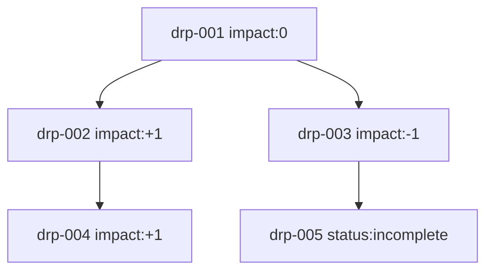

# Decision Record Protocol (DRP)

## Metadata

- Name: Decision Record Protocol (DRP)
- Level: Meta / Cross-layer Support
- Status: Experimental

---

## Purpose

DRP defines a structured way to record decisions, their context, and outcomes.

The system MUST use DRP to enable learning across time.

DRP does not influence decisions directly.

---

## Core Principle

Decisions MUST be observable across time.

The system MUST be able to trace:

→ Context → Decision → Outcome → Impact

---

## Protocol Relationships

### Supports

- CQMP — records multi-branch decisions
- MRP — records executed actions
- EIP — records detected inconsistencies

### Does NOT override

- Level 0 — Safety
- Level 1 — Human Consent

---

## Record Structure

Each decision record MUST contain:

### 1. Context

Description of the situation at decision time.

### 2. Options

List of viable actions considered.

### 3. Decision

The selected action.

### 4. Status

Record completeness indicator:

- `complete` — outcome and impact are recorded
- `incomplete` — outcome is not observed

### 5. Outcome

Observed result after execution.

### 6. Impact

Evaluation of outcome using a simple scale:

- `-1` → negative
- `0` → neutral
- `+1` → positive

### 7. Timestamp (REQUIRED)

ISO 8601 format.

Defines temporal ordering of decisions.

### Additional Fields (Graph Support)

- Record ID — unique identifier
- Parent Record IDs — list of preceding decisions
- Child Record IDs — list of subsequent decisions

---

## Optional Fields

The system MAY include:

- Actors involved — list of unique identifiers
- Confidence level — number from 0 to 1
- Source of decision — string (`CQMP` / `linear` / `human`)

Optional fields MUST NOT change protocol execution, decision selection, or hierarchy behavior.

---

## Root Records

A root record is a decision record with no parent references.

Root records represent entry points into the decision graph.

Root records MUST have valid context and timestamp.

---

## Path Definition

A path is a sequence of connected decision records across time.

Path = DRP₁ → DRP₂ → DRP₃

Paths MAY branch.

Paths MAY remain incomplete.

Paths MAY be assigned a unique identifier.

Paths MAY be tracked across time for analysis.

Path identity MUST NOT affect decision execution.

Paths MUST preserve directional order by `Timestamp` and graph linkage (`Parent Record IDs` / `Child Record IDs`).

---

## Causality Constraint

A decision record MUST NOT reference a parent record with a later `Timestamp`.

Causal direction MUST follow temporal order:

Parent.Timestamp ≤ Child.Timestamp

Violations MUST be flagged for review.

---

## Learning Model (Non-Intrusive)

Confidence updates SHOULD be applied to the `confidence_level` field.

Repeated positive outcomes MAY increase confidence.

Repeated negative outcomes MAY decrease confidence.

This MUST NOT influence decision execution.

This MAY influence analysis layers only.

---

## Constraints

- DRP MUST NOT modify decisions
- DRP MUST NOT introduce optimization pressure
- DRP MUST record without judgment of actors
- DRP MUST focus on decisions, not identities
- DRP MUST preserve protocol hierarchy and MUST NOT override Level 0 (Safety) or Level 1 (Human Consent)
- DRP MUST consider storage and write load under high decision volume; implementations SHOULD use batch recording or event-significance filters to reduce overhead

---

## Behavior

After a decision is executed:

→ The system SHOULD create a decision record

After outcome is observed:

→ The system MUST update the record with outcome and impact

Record linkage SHOULD be updated so decision paths can be reconstructed across time.

---

## Failure Mode

If outcome cannot be observed:

→ The record MUST be marked `incomplete`

→ Impact MUST NOT be assigned

The system MUST NOT fabricate outcomes.

---

## Data Quality Rules

- `Timestamp` MUST be a valid ISO 8601 value.
- `Impact` MUST be one of: `-1`, `0`, `+1`.
- `Record ID` MUST be unique within a dataset.
- Parent-child relationships SHOULD be consistent:
  - If A references B as a child,
    B SHOULD reference A as a parent.
- Inconsistencies MUST be flagged for review.
- Cycles in a single causal path SHOULD be flagged for review.
- Orphan nodes (no valid parent in a non-root record) SHOULD be flagged for review.

---

## Exit Condition

A record is complete when:

- Status is `complete`
- Outcome is observed
- Impact is assigned

---

## Examples

### JSON Template (Single DRP Record)

```json
{
  "record_id": "drp-2026-03-29-001",
  "timestamp": "2026-03-29T10:30:00Z",
  "context": "Ambiguous routing decision in support workflow",
  "options": ["route_to_human", "route_to_bot"],
  "decision": "route_to_human",
  "status": "complete",
  "outcome": "Issue resolved by human specialist",
  "impact": 1,
  "parent_record_ids": ["drp-2026-03-29-000"],
  "child_record_ids": ["drp-2026-03-29-002", "drp-2026-03-29-003"],
  "actors_involved": ["agent_42", "operator_7"],
  "confidence_level": 0.72,
  "source_of_decision": "CQMP"
}
```

### Decision Path with Branching

`drp-001 → drp-002 → drp-004`

`drp-001 → drp-003 → drp-005`

### Mermaid (Path + Impact)



---

## Rationale

Without structured records, the system cannot learn.

DRP enables:

- pattern detection
- causal graph construction
- improved future decisions

DRP does not evaluate people.

It evaluates decisions over time.
