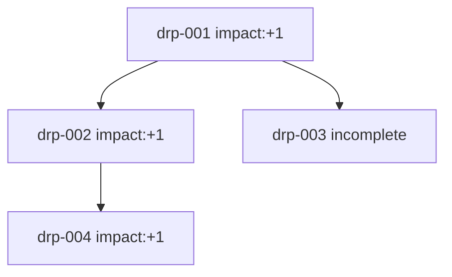
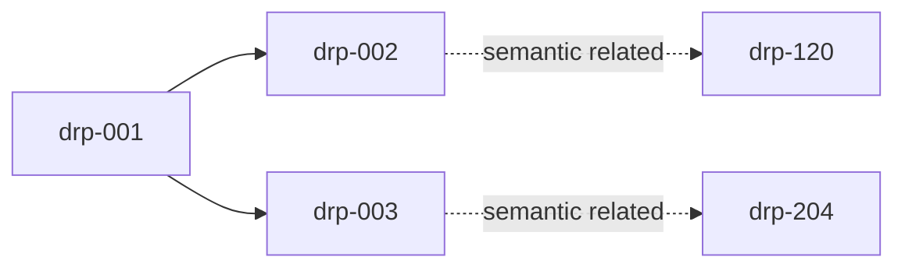

# Decision Record Protocol (DRP)

## 1. Metadata

- Name: Decision Record Protocol (DRP)
- Level: Meta / Cross-layer Support
- Status: Experimental
- Scope Type: Documentation and analysis support

---

## 2. Purpose

**TL;DR:** DRP is a formal memory of decisions and outcomes across time.

DRP defines a strict specification to record decision context, selected actions, outcomes, impacts, and graph links.

DRP MUST preserve traceability across time.

DRP MUST remain non-intrusive and MUST NOT execute decisions.

---

## 3. Scope & Non-Goals

**TL;DR:** DRP stores and traces decisions; it does not decide or execute.

### DRP IS

- a decision memory
- a trace system
- an analysis support layer

### DRP IS NOT

- a decision engine
- an optimization engine
- an execution system

---

## 4. Core Principles

**TL;DR:** DRP guarantees consistent, auditable decision records.

- DRP MUST treat each record as a decision trace artifact.
- DRP MUST keep causal order explicit.
- DRP MUST keep semantic similarity separate from execution authority.
- DRP MUST preserve Level 0 (Safety) and Level 1 (Human Consent) precedence.

---

## 5. Protocol Relationships

**TL;DR:** DRP supports other protocols through recording only.

### Supports

- CQMP — records branch exploration and selected branch outcomes. See [docs/protocols/Conditional_Quantum_Mode.md](./Conditional_Quantum_Mode.md) and [guardrails/CONDITIONAL_QUANTUM_MODE_PROTOCOL.md](../../guardrails/CONDITIONAL_QUANTUM_MODE_PROTOCOL.md).
- MRP — records executed minimal-resolution actions and consequences. See [guardrails/MINIMAL_RESOLUTION_PROTOCOL.md](../../guardrails/MINIMAL_RESOLUTION_PROTOCOL.md).
- EIP — records ambiguity/error detection and resulting outcomes. See [guardrails/ERROR_ILLUMINATION_PROTOCOL.md](../../guardrails/ERROR_ILLUMINATION_PROTOCOL.md).

### Does NOT override

- Level 0 — Safety
- Level 1 — Human Consent

DRP MUST remain subordinate to hierarchy constraints.

---

## 6. Record Schema (Formal Table)

**TL;DR:** Use one normalized schema with strict names and constraints.

| Field | Type | Required | Constraints | Description |
| --- | --- | --- | --- | --- |
| `record_id` | string | MUST | Unique within dataset | Record identifier |
| `context` | string | MUST | Non-empty | Decision-time context; MUST explain why, not only what |
| `options` | array<string> | MUST | Length >= 1 | Viable options considered |
| `decision` | string | MUST | Non-empty | Selected option |
| `status` | enum | MUST | `proposed` \| `complete` \| `incomplete` \| `superseded` | Decision record state |
| `outcome` | string or null | MUST | Null allowed only when unresolved | Observed result |
| `impact` | enum or null | MUST | `-1` \| `0` \| `+1` \| `null` | Outcome impact value |
| `timestamp` | string | MUST | ISO 8601 | Decision timestamp |
| `parent_record_ids` | array<string> | MUST | Empty only for root records | Direct causal parents |
| `child_record_ids` | array<string> | MUST | Empty allowed | Direct causal children |
| `related_records` | array<string> | MAY | Semantic references only | Meaning-based links |
| `actors_involved` | array<string> | MAY | Unique IDs only | Associated actors |
| `confidence_level` | number | MAY | 0 <= x <= 1 | Analysis confidence field |
| `source_of_decision` | string | MAY | `CQMP` \| `linear` \| `human` | Origin label |
| `semantic_index` | string/object reference | MAY | Versioned reference | Embedding index identifier |

### ENUM Definitions

- `status`: `proposed`, `complete`, `incomplete`, `superseded`
- `impact`: `-1`, `0`, `+1`

---

## 7. Field Semantics (Rules)

**TL;DR:** Field values MUST obey invariants.

### Explicit Invariants

- `status = complete` ⇒ `outcome != null` AND `impact != null`
- `status = incomplete` ⇒ `outcome = null` AND `impact = null`
- `status = proposed` ⇒ `outcome = null` AND `impact = null`
- `status = superseded` ⇒ record remains immutable; supersession MUST be represented by a new record
- `timestamp` MUST be parseable ISO 8601
- `record_id` MUST be unique
- `parent_record_ids = []` defines a root record

### Decision Integrity Rules (ADR-aligned)

- One record MUST represent one decision event.
- Records MUST be append-only.
- History MUST NOT be rewritten.
- Changes MUST create new records, not in-place edits.
- `context` MUST capture rationale (why), not only action text (what).

---

## 8. Lifecycle (Behavior)

**TL;DR:** Create once, update with outcome, never rewrite history.

### Decision Status Evolution

`proposed → complete` or `proposed → incomplete`

`complete → superseded` ONLY via new record that references prior record

Lifecycle rules:

- System MUST create a record when a decision is formed.
- System MUST update status/outcome/impact when evidence appears.
- System MUST preserve prior records when a decision is superseded.
- System MUST preserve trace links across lifecycle transitions.

---

## 9. Graph Model (Causality + Paths)

**TL;DR:** DRP has two graph layers: causal and path-level trace.

### 9.1 Causal Graph (parent-child)

- Causal edges are defined by `parent_record_ids` and `child_record_ids`.
- Causal graph MUST represent time-consistent dependencies.
- Root records MUST have no parents.

### 9.2 Path Model

- A path is an ordered causal sequence: `DRP_1 → DRP_2 → DRP_3`.
- Paths MAY branch.
- Paths MAY remain incomplete.
- Paths MAY use `path_id` in analysis contexts.
- Path identity MUST NOT influence execution behavior.

### Formal Causality Rules

- `Parent.timestamp <= Child.timestamp`
- Future-parent references MUST NOT occur.
- Cycles SHOULD be flagged for review.

---

## 10. Semantic Layer

**TL;DR:** Semantic links accelerate lookup, never execution.

### 10.1 Semantic Graph (related_records)

- Semantic edges are defined by `related_records`.
- Semantic edges represent meaning similarity, not temporal causality.
- Semantic graph MUST remain separate from causal authority.

### 10.2 Semantic Matching Guarantees

- Semantic matching MUST NOT affect decision execution.
- Semantic matching MUST NOT override hierarchy or protocols.
- Semantic matching MUST NOT mutate records.

### 10.3 Similarity Threshold Governance

- Threshold configuration MUST be versioned.
- Embedding model/version MUST be logged.
- Similarity score MUST be included in lookup response.

### 10.4 DRP Lookup Behavior

When a semantic match is accepted, DRP MUST return stored evidence fields:

- `decision`
- `outcome`
- `impact`
- `source_record_id`
- `similarity`

DRP lookup MUST remain read-only.

---

## 11. Constraints

**TL;DR:** DRP is strict, passive, and hierarchy-safe.

- DRP MUST NOT modify decision execution.
- DRP MUST NOT optimize actor behavior.
- DRP MUST preserve Level 0 and Level 1 precedence.
- DRP MUST support traceability without adding decision authority.
- DRP SHOULD support high-volume operation with batching and significance filters.

### Protocol Guarantees

- Traceability
- Immutability
- Non-intrusiveness
- Temporal consistency

### Known Limitations

- DRP has no automatic learning authority.
- DRP has no decision authority.
- DRP quality depends on input record quality.

---

## 12. Data Quality Rules

**TL;DR:** Invalid structure MUST be detectable and reviewable.

- `record_id` MUST be unique.
- `timestamp` MUST be valid ISO 8601.
- `impact` MUST be `-1`, `0`, or `+1` when present.
- Parent-child consistency SHOULD hold:
  - If A lists B in `child_record_ids`, B SHOULD list A in `parent_record_ids`.
- Inconsistencies MUST be flagged for review.
- Non-root records without valid parents SHOULD be flagged as orphan nodes.
- Semantic lookup traces SHOULD include query timestamp, threshold version, embedding model version, similarity, and `source_record_id`.

---

## 13. Failure Modes

**TL;DR:** Missing evidence keeps records incomplete; no fabrication.

- If outcome is unobserved, record MUST remain `incomplete`.
- In incomplete state, `outcome` MUST be `null`.
- In incomplete state, `impact` MUST be `null`.
- System MUST NOT fabricate outcomes.
- System MUST NOT fabricate impact.

---

## 14. Examples

**TL;DR:** Examples show valid, minimal, invalid, and semantic-lookup cases.

### 14.1 Minimal Example (5 lines)

```json
{
  "record_id": "drp-min-001",
  "context": "User request requires escalation",
  "decision": "route_to_human",
  "status": "proposed",
  "timestamp": "2026-03-30T12:00:00Z"
}
```

### 14.2 Valid Branching Path (Multiple Records)

```json
[
  {
    "record_id": "drp-2026-03-30-001",
    "context": "Incoming support request with unclear ownership",
    "options": ["route_to_human", "route_to_bot"],
    "decision": "route_to_human",
    "status": "complete",
    "outcome": "Case triaged by specialist",
    "impact": 1,
    "timestamp": "2026-03-30T09:00:00Z",
    "parent_record_ids": [],
    "child_record_ids": ["drp-2026-03-30-002", "drp-2026-03-30-003"]
  },
  {
    "record_id": "drp-2026-03-30-002",
    "context": "Follow-up on specialist route",
    "options": ["request_logs", "close_case"],
    "decision": "request_logs",
    "status": "complete",
    "outcome": "Logs received",
    "impact": 1,
    "timestamp": "2026-03-30T09:05:00Z",
    "parent_record_ids": ["drp-2026-03-30-001"],
    "child_record_ids": ["drp-2026-03-30-004"]
  },
  {
    "record_id": "drp-2026-03-30-003",
    "context": "Automation alternative branch",
    "options": ["route_to_bot", "escalate_human"],
    "decision": "route_to_bot",
    "status": "incomplete",
    "outcome": null,
    "impact": null,
    "timestamp": "2026-03-30T09:06:00Z",
    "parent_record_ids": ["drp-2026-03-30-001"],
    "child_record_ids": []
  }
]
```

### 14.3 Incomplete Record Example

```json
{
  "record_id": "drp-2026-03-30-010",
  "context": "External dependency status unknown",
  "options": ["wait", "fallback"],
  "decision": "wait",
  "status": "incomplete",
  "outcome": null,
  "impact": null,
  "timestamp": "2026-03-30T10:00:00Z",
  "parent_record_ids": [],
  "child_record_ids": []
}
```

### 14.4 Semantic Lookup Match Example

```json
{
  "query": "Need specialist for ambiguous support issue",
  "threshold_version": "semantic_threshold_v1",
  "threshold": 0.85,
  "embedding_model": "text-embedding-v1",
  "matches": [
    {
      "source_record_id": "drp-2026-03-30-001",
      "similarity": 0.91,
      "decision": "route_to_human",
      "outcome": "Case triaged by specialist",
      "impact": 1,
      "timestamp": "2026-03-30T09:00:00Z"
    }
  ]
}
```

### 14.5 Invalid Record Example

```json
{
  "record_id": "drp-invalid-001",
  "context": "Follow-up decision",
  "options": ["close_case"],
  "decision": "close_case",
  "status": "complete",
  "outcome": null,
  "impact": null,
  "timestamp": "2026-03-30T08:00:00Z",
  "parent_record_ids": ["drp-2026-03-30-999"],
  "child_record_ids": []
}
```

Why invalid:

- `status = complete` but `outcome` is `null`.
- `status = complete` but `impact` is `null`.
- Parent reference may be unresolved (potential orphan).

### 14.6 Mermaid — Branching + Impact



### 14.7 Mermaid — Causal vs Semantic



---

## 15. Rationale

DRP formalizes decision memory with strict constraints and explicit graph semantics.

It enables:

- auditable trace chains
- causal path reconstruction
- semantic retrieval for analysis reuse

DRP preserves protocol safety by remaining read-oriented, non-intrusive, and hierarchy-subordinate.
