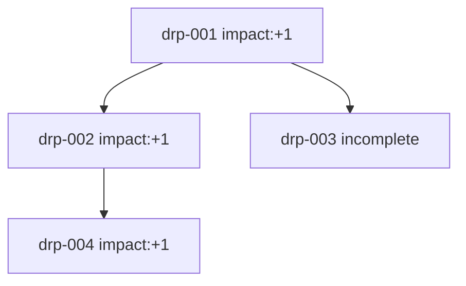
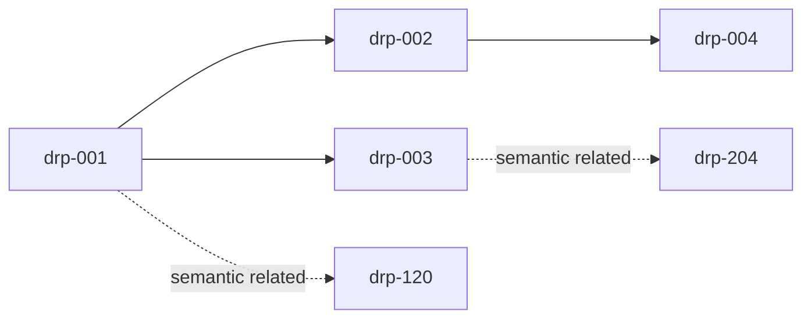

# Decision Record Protocol (DRP)

## Metadata

- Name: Decision Record Protocol (DRP)
- Level: Meta / Cross-layer Support
- Status: Experimental
- Scope: Documentation and analysis support only

---

## Purpose

DRP defines a standardized format to record decisions, decision context, observed outcomes, and impact over time.

The system MUST use DRP to preserve traceability and support longitudinal analysis.

DRP MUST remain non-intrusive and MUST NOT execute, alter, or override decision logic.

---

## Core Principle

Decisions MUST be observable across time.

The system MUST support the trace chain:

`Context → Decision → Outcome → Impact`

---

## Protocol Relationships

### Supports

- CQMP — records multi-branch decision exploration and selected branch outcome. See [docs/protocols/Conditional_Quantum_Mode.md](./Conditional_Quantum_Mode.md) and [guardrails/CONDITIONAL_QUANTUM_MODE_PROTOCOL.md](../../guardrails/CONDITIONAL_QUANTUM_MODE_PROTOCOL.md).
- MRP — records executed minimal-resolution actions and consequences. See [guardrails/MINIMAL_RESOLUTION_PROTOCOL.md](../../guardrails/MINIMAL_RESOLUTION_PROTOCOL.md).
- EIP — records ambiguity/error discovery and downstream correction outcomes. See [guardrails/ERROR_ILLUMINATION_PROTOCOL.md](../../guardrails/ERROR_ILLUMINATION_PROTOCOL.md).

### Does NOT override

- Level 0 — Safety
- Level 1 — Human Consent

DRP MUST remain subordinate to protocol hierarchy and MUST NOT introduce control behavior.

---

## Record Structure

Each DRP record MUST contain the following required fields.

| Field | Type | Requirement | Description |
| --- | --- | --- | --- |
| `record_id` | string | MUST | Unique identifier of this record. |
| `context` | string | MUST | Situation snapshot at decision time. |
| `options` | array of strings | MUST | Viable options considered. |
| `decision` | string | MUST | Selected option/action. |
| `status` | enum | MUST | `complete` or `incomplete`. |
| `outcome` | string or null | MUST | Observed result. MUST be `null` when not yet observed. |
| `impact` | enum or null | MUST | `-1`, `0`, `+1`. MUST be `null` when status is `incomplete`. |
| `timestamp` | string | MUST | ISO 8601 decision-time marker. |
| `parent_record_ids` | array of strings | MUST | Direct causal parents. Empty for root records. |
| `child_record_ids` | array of strings | MUST | Direct causal children. Empty allowed. |

Required field semantics:

- `status = complete` implies `outcome != null` and `impact != null`.
- `status = incomplete` implies `outcome = null` and `impact = null`.
- `timestamp` MUST be parseable as ISO 8601.

---

## Optional Fields

The system MAY include optional fields for analysis enrichment:

| Field | Type | Purpose |
| --- | --- | --- |
| `actors_involved` | array of strings | Unique actor identifiers related to the record. |
| `confidence_level` | number | Confidence in `[0, 1]` used for analysis only. |
| `source_of_decision` | string | Origin label (`CQMP`, `linear`, `human`). |
| `semantic_index` | string/object reference | Reference to semantic embedding index used for matching. |
| `related_records` | array of strings | Record IDs with semantic similarity links. |

Optional fields MUST NOT change execution, safety, consent enforcement, or branch selection.

---

## Semantic Matching

A query MAY be converted to an embedding and compared against historical DRP records.

A semantic match MAY be accepted when similarity is greater than or equal to a configured threshold (example: `0.85`).

Semantic matching MUST be lookup-only:

- MUST NOT execute new decision logic.
- MUST NOT rewrite historical decisions.
- MUST preserve full traceability to source records.

Best-practice guidance:

- Threshold SHOULD be explicitly versioned (for example, `semantic_threshold_v1 = 0.85`).
- Embedding model/version SHOULD be logged with lookup traces.
- Similarity scoring method SHOULD remain stable per evaluation period.

---

## DRP Lookup Behavior

When semantic matching returns a valid hit, DRP SHOULD return previously recorded decision evidence.

DRP lookup response SHOULD include:

- `decision`
- `outcome`
- `impact`
- `source_record_id`
- `similarity`

DRP lookup MUST remain non-intrusive and MUST NOT mutate records.

Example lookup response:

```json
{
  "decision": "route_to_human",
  "outcome": "Issue resolved by human specialist",
  "impact": 1,
  "source_record_id": "drp-2026-03-30-001",
  "similarity": 0.91
}
```

---

## Root Records

A root record is a record with no parents (`parent_record_ids = []`).

Root records represent entry points into a causal graph.

Root records MUST contain valid `context` and `timestamp`.

---

## Path Definition

A path is an ordered sequence of causally linked records across time.

`DRP_1 → DRP_2 → DRP_3`

Path rules:

- Paths MAY branch.
- Paths MAY remain incomplete.
- Paths MAY be assigned a unique `path_id` for analytics.
- Path identity MUST NOT affect decision execution.
- `related_records` MAY define semantic edges that overlay the causal graph.

---

## Causality Constraint

A child record MUST NOT reference a parent record with a later timestamp.

Causality MUST follow temporal order:

`Parent.timestamp ≤ Child.timestamp`

Violations MUST be flagged for review.

---

## Learning Model

DRP learning is passive and analysis-only.

- Confidence updates SHOULD target `confidence_level`.
- Repeated positive outcomes MAY increase confidence.
- Repeated negative outcomes MAY decrease confidence.

This model MUST NOT influence decision execution.

---

## Constraints

- DRP MUST NOT modify decisions.
- DRP MUST NOT introduce optimization pressure on actors.
- DRP MUST record decisions, not identities.
- DRP MUST preserve Level 0 (Safety) and Level 1 (Human Consent) precedence.
- DRP MUST support semantic reuse without re-solving already matched decision patterns.
- DRP MUST NOT mutate historical records during lookup.
- DRP SHOULD support high-volume operation using batching and event-significance filters.

High-load storage recommendations:

- Use append-only storage for write safety.
- Use asynchronous batch ingestion for large decision volumes.
- Index at minimum: `record_id`, `timestamp`, `impact`, `status`.

Future-extension recommendations:

- Graph backends (for example Neo4j) MAY be used for causal/semantic traversal.
- Vector indices MAY be separated from canonical DRP storage to avoid coupling.

---

## Behavior

After a decision is executed:

→ The system SHOULD create a DRP record.

After outcome observation:

→ The system MUST update the same record with `outcome`, `impact`, and `status`.

After semantic lookup:

→ The system SHOULD return matched historical evidence and preserve lookup trace metadata.

---

## Failure Mode

If outcome cannot be observed:

- Record MUST remain `incomplete`.
- `outcome` MUST remain `null`.
- `impact` MUST remain `null`.

The system MUST NOT fabricate outcomes or impact.

---

## Data Quality Rules

- `record_id` MUST be unique within a dataset.
- `timestamp` MUST be valid ISO 8601.
- `impact` MUST be one of `-1`, `0`, `+1` when present.
- Parent-child consistency SHOULD hold:
  - If A lists B in `child_record_ids`, B SHOULD list A in `parent_record_ids`.
- Inconsistencies MUST be flagged for review.
- Cycles SHOULD be flagged for review unless explicitly allowed by versioned policy.
- Non-root records without valid parents SHOULD be flagged as orphan nodes.
- Semantic lookup traces SHOULD include: query timestamp, threshold version, embedding model version, similarity, and `source_record_id`.

---

## Exit Condition

A record is complete when ALL are true:

- `status = complete`
- `outcome != null`
- `impact != null`

---

## Examples

### Example A — Branching Path (Multiple Records)

```json
[
  {
    "record_id": "drp-2026-03-30-001",
    "context": "Incoming support request with unclear ownership",
    "options": ["route_to_human", "route_to_bot"],
    "decision": "route_to_human",
    "status": "complete",
    "outcome": "Case triaged by specialist",
    "impact": 1,
    "timestamp": "2026-03-30T09:00:00Z",
    "parent_record_ids": [],
    "child_record_ids": ["drp-2026-03-30-002", "drp-2026-03-30-003"],
    "source_of_decision": "CQMP"
  },
  {
    "record_id": "drp-2026-03-30-002",
    "context": "Follow-up action on specialist route",
    "options": ["request_logs", "close_case"],
    "decision": "request_logs",
    "status": "complete",
    "outcome": "Logs received",
    "impact": 1,
    "timestamp": "2026-03-30T09:05:00Z",
    "parent_record_ids": ["drp-2026-03-30-001"],
    "child_record_ids": ["drp-2026-03-30-004"],
    "source_of_decision": "linear"
  },
  {
    "record_id": "drp-2026-03-30-003",
    "context": "Alternative branch for automation route",
    "options": ["route_to_bot", "escalate_human"],
    "decision": "route_to_bot",
    "status": "incomplete",
    "outcome": null,
    "impact": null,
    "timestamp": "2026-03-30T09:06:00Z",
    "parent_record_ids": ["drp-2026-03-30-001"],
    "child_record_ids": [],
    "source_of_decision": "CQMP"
  },
  {
    "record_id": "drp-2026-03-30-004",
    "context": "Logs analyzed",
    "options": ["close_case", "reopen_case"],
    "decision": "close_case",
    "status": "complete",
    "outcome": "Resolved",
    "impact": 1,
    "timestamp": "2026-03-30T09:10:00Z",
    "parent_record_ids": ["drp-2026-03-30-002"],
    "child_record_ids": [],
    "source_of_decision": "human"
  }
]
```

### Example B — Incomplete Record

```json
{
  "record_id": "drp-2026-03-30-010",
  "context": "External dependency status unknown",
  "options": ["wait", "fallback"],
  "decision": "wait",
  "status": "incomplete",
  "outcome": null,
  "impact": null,
  "timestamp": "2026-03-30T10:00:00Z",
  "parent_record_ids": [],
  "child_record_ids": []
}
```

### Example C — Semantic Lookup Match

```json
{
  "query": "Need specialist for ambiguous support issue",
  "threshold": 0.85,
  "matches": [
    {
      "source_record_id": "drp-2026-03-30-001",
      "similarity": 0.91,
      "decision": "route_to_human",
      "outcome": "Case triaged by specialist",
      "impact": 1,
      "timestamp": "2026-03-30T09:00:00Z"
    }
  ]
}
```

### Mermaid — Branching + Impact



### Mermaid — Causal Graph with Semantic Overlay



---

## Rationale

Without structured records, systems cannot reliably analyze historical decision quality or reconstruct causal paths.

DRP enables:

- Pattern detection over decision histories.
- Causal and semantic graph analysis.
- Passive learning signals without intervention in execution logic.

DRP evaluates decision trajectories over time, not people.
